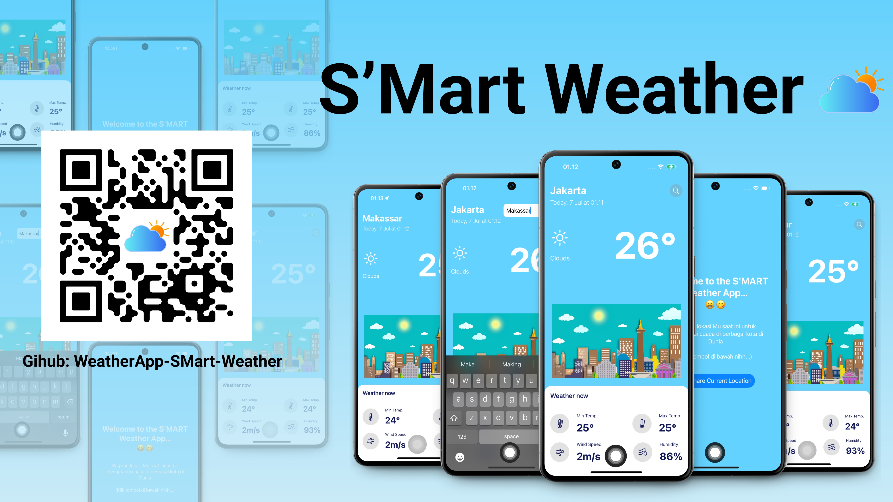

<h1 align="center">WEATHERAPPTRACKER – S'MART WEATHER</h1>

<p align="center">
  <em>Track Global Weather in Real-Time with S'Mart Weather</em>
</p>

<p align="center">
  
  
  
</p>

---

## Overview

**WeatherAppTracker – S'Mart Weather** is an iOS application designed to provide **accurate and real-time weather information for any city worldwide**.  
The app integrates with the [OpenWeather API](https://openweathermap.org/api) to deliver up-to-date data, displayed in a clean and intuitive interface.

### Why Choose S'Mart Weather?

S'Mart Weather focuses on simplicity, speed, and reliability, allowing users to get the weather information they need with just a few taps.

Its core features include:

- **Search Worldwide** – Find weather information for any city across the globe.
- **Real-Time Data** – Weather details updated live from the OpenWeather API.
- **Comprehensive Weather Metrics** – See current conditions, temperature, humidity, wind speed, and more.
- **Modern iOS UI** – Clean, fast, and user-friendly design for a smooth experience.

---

## App Preview

<p align="center">
  
</p>

---

## Features

- **Search Bar** – Quickly search for any city around the world.
- **Live Weather Data** – Get real-time updates including:
  - Weather condition (Clear, Rainy, Cloudy, etc.)
  - Temperature
  - Min & Max temperature
  - Wind speed
  - Humidity
  - Date and time (day, date, month, hour)
- **Global Coverage** – Works for any city worldwide.
- **Clean UI** – Focused on delivering information quickly.

---

## Built With

<p>
  
  
  
</p>

---

## Installation

1. Clone the repository:

```bash
git clone https://github.com/zensantomart017/WeatherApp-SMart-Weather.git
